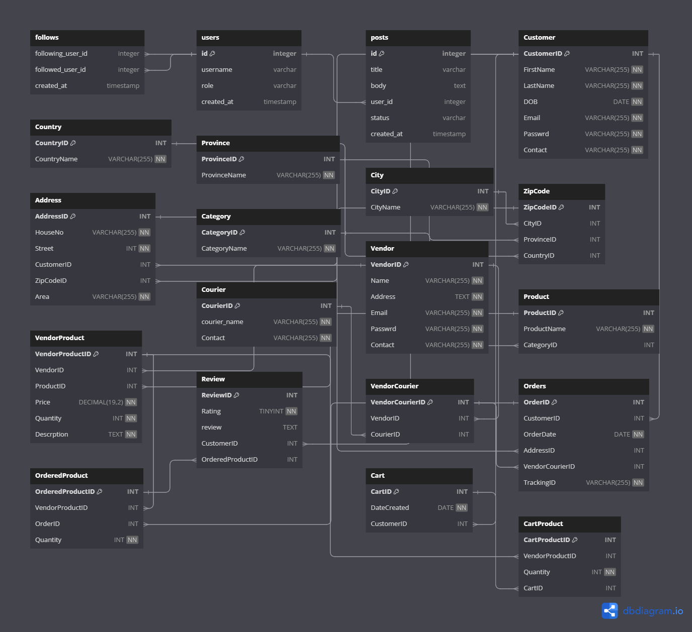

# 🛍️ ShopperStop E-commerce DBMS

---

## 📝 Overview

The **ShopperStop E-commerce DBMS** is a relational database designed to manage key aspects of an online retail platform. Built with 3NF-normalized tables, it ensures:

- 🛠️ **Data Integrity**  
- 🚀 **Scalability**  
- 💾 **Efficient Data Management**  

This system streamlines operations, provides secure data handling, and delivers a seamless shopping experience for users.

---

## ✨ Features

- 👥 **Customer Management:** Manage detailed records, including contact info and addresses.  
- 📦 **Inventory Control:** Track products, categories, and vendor details.  
- 🛒 **Order Processing:** Handle orders, shipping, and tracking seamlessly.  
- 🤝 **Vendor & Courier Integration:** Enable smooth collaboration for deliveries.  
- 🌟 **Review System:** Allow customers to rate and review products.  
- 🛍️ **Shopping Cart Functionality:** Manage cart items efficiently.

---

## 🗺️ ER Diagram

Below is the ER Diagram illustrating the structure and relationships of the database.

---

## 🏗️ Database Structure

- **📋 Customers, Addresses, and Regions:** Manage user profiles and geographical details (country, province, city, zip codes).
- **📚 Products and Categories:** Organize products for cataloging and inventory tracking.
- **📑 Orders and Carts:** Process orders, handle cart items, and track product quantities.
- **🚚 Vendors and Couriers:** Manage vendor supplies and delivery logistics.
- **⭐ Reviews:** Collect customer feedback for product insights.

---

## 💾 SQL Scripts

This repository includes the following SQL scripts:

1. **`ShopperStop_Script.sql`:** 📜 The complete SQL schema to set up the database.
2. **`s-p,v,func.sql`:** 🧩 Stored procedures, views, and functions for advanced database operations.

---
